# Capturas de la Base de Datos

- Esquema de la Base de datos
  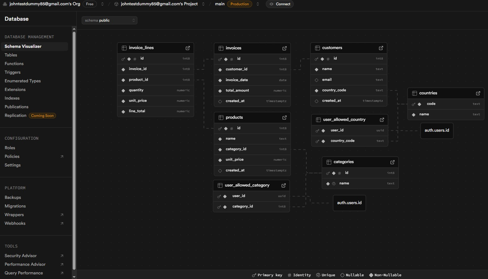
- Tablas y Vistas en la Base de datos
  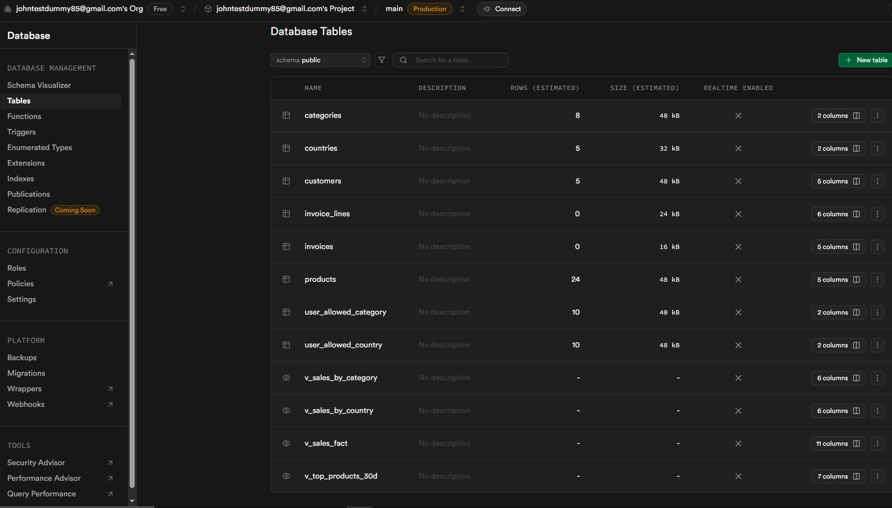
- Función para crear invoice
  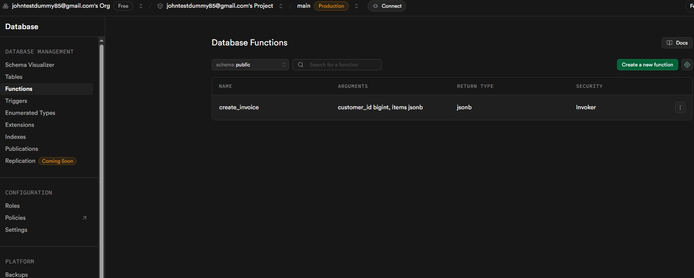
- Políticas
  
  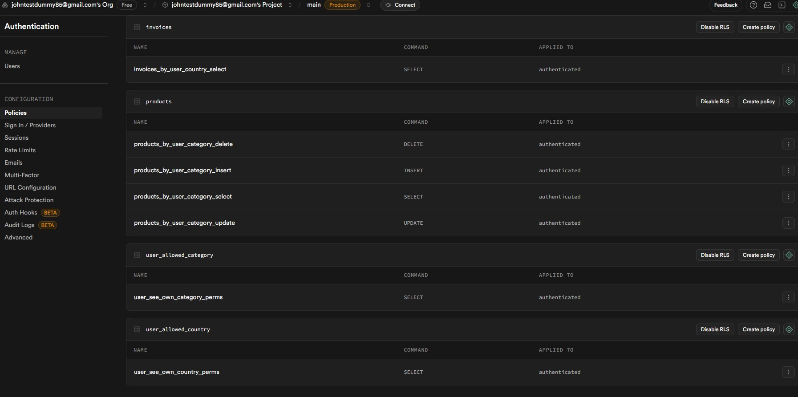
- Usuarios permitidos
  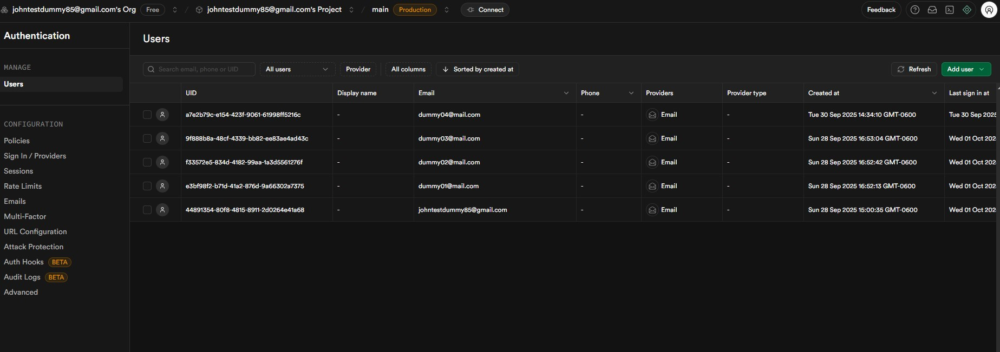

# Capturas de ejecución en Python
Se realizó un pequeño cambio al programa para seleccionar la información de varios usuarios a la vez. Los credenciales de estos usuarios están en el [.env](../.env). Los permisos van variando entre cada uno.
- Selección de usuario
![[loginpy.jpg]]
- Opciones del menú
  ![[menupy.jpg]]
- Crear Invoice
  ![[crearInvoicepy.jpg]]
- Listar Invoices
  ![[listInvoicepy.jpg]]
- Filtrar por Cliente
  ![[invoiceByCustomerpy.jpg]]
- Filtrar por Producto
  ![[invoiceByProductpy.jpg]]
- Filtrar por País
  ![[invoiceByCountrypy.jpg]]
- Filtrar por rango de fechas
  ![[invoiceByDatespy.jpg]]
# Capturas Postman
El archivo [collection de postman](../tests/Lab_Ventas_Supabase.postman_collection.json) contiene algunos ejemplos de llamadas al API de supabase, entre ellos están los que son proveídos automáticamente como llamadas a tablas y el RPC para crear invoices. Todos estos son afectados por las políticas de la base de datos. Sin embargo, se utiliza la llave maestra en este caso por facilidad.
- Crear Invoice
![[createInvoicePost.jpg]]
- Clientes por País
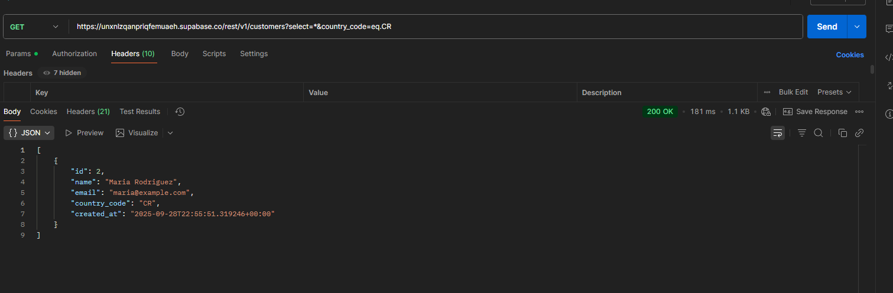
- Producto Embedido
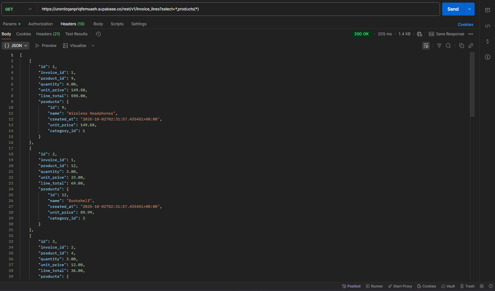
- Factura con cliente embedido
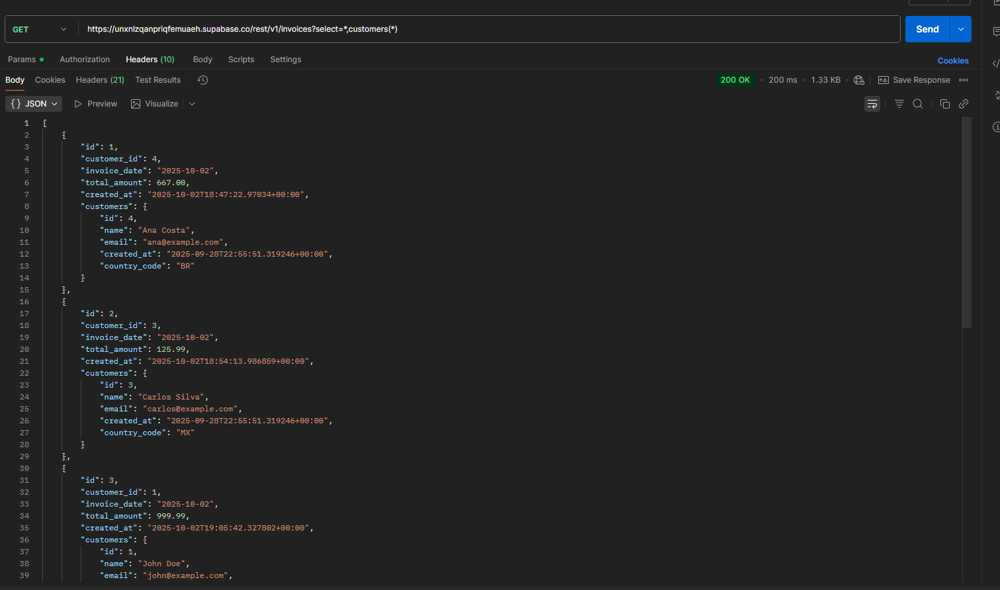
- Insertar Factura
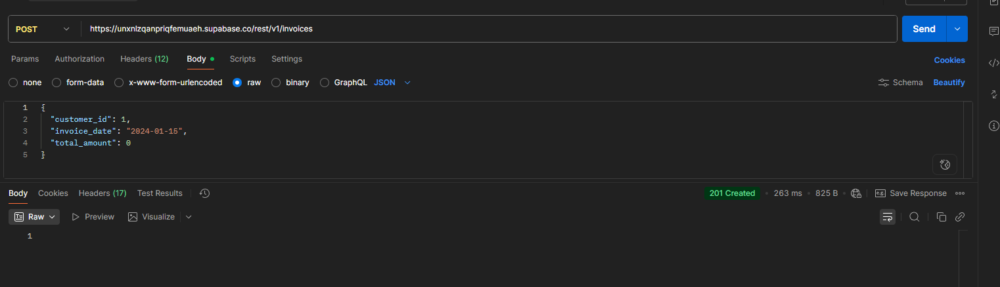
- Insertar Líneas Factura
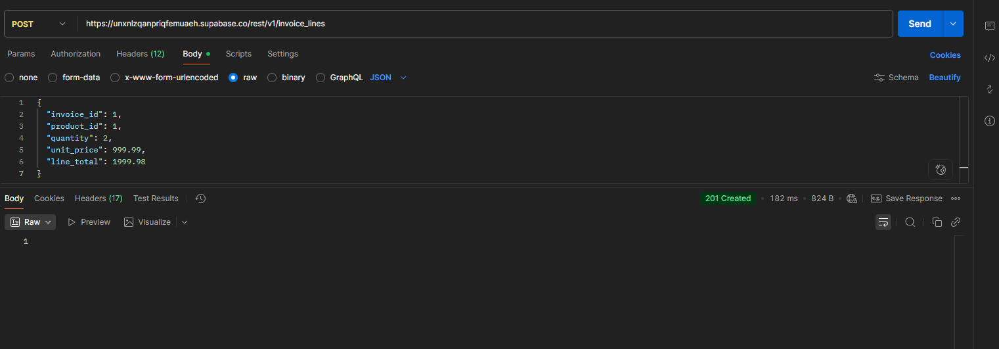
- Producto por categoría
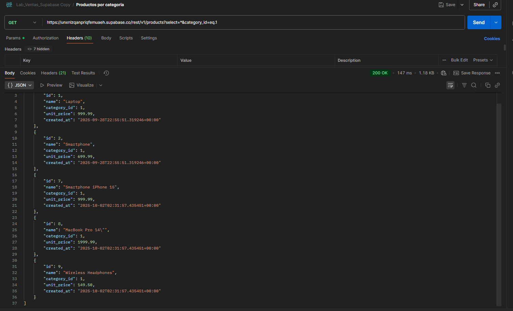