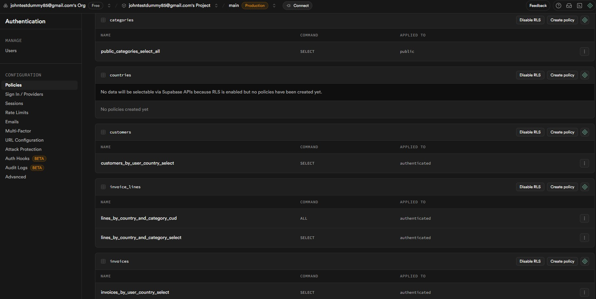

# Capturas de la Base de Datos

- Esquema de la Base de datos
  
- Tablas y Vistas en la Base de datos
  
- Función para crear invoice
  
- Políticas
  
  
- Usuarios permitidos
  

# Capturas de ejecución en Python
- Se realizó un pequeño cambio al programa para imprimir la información de varios usuarios a la vez. Los credenciales de estos usuarios están en el [.env](../.env). Los permisos van variando entre cada uno.

![[ejecucionPython.jpg]]

# Capturas Postman